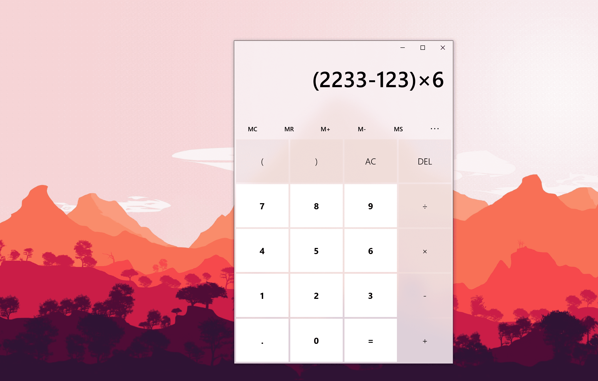
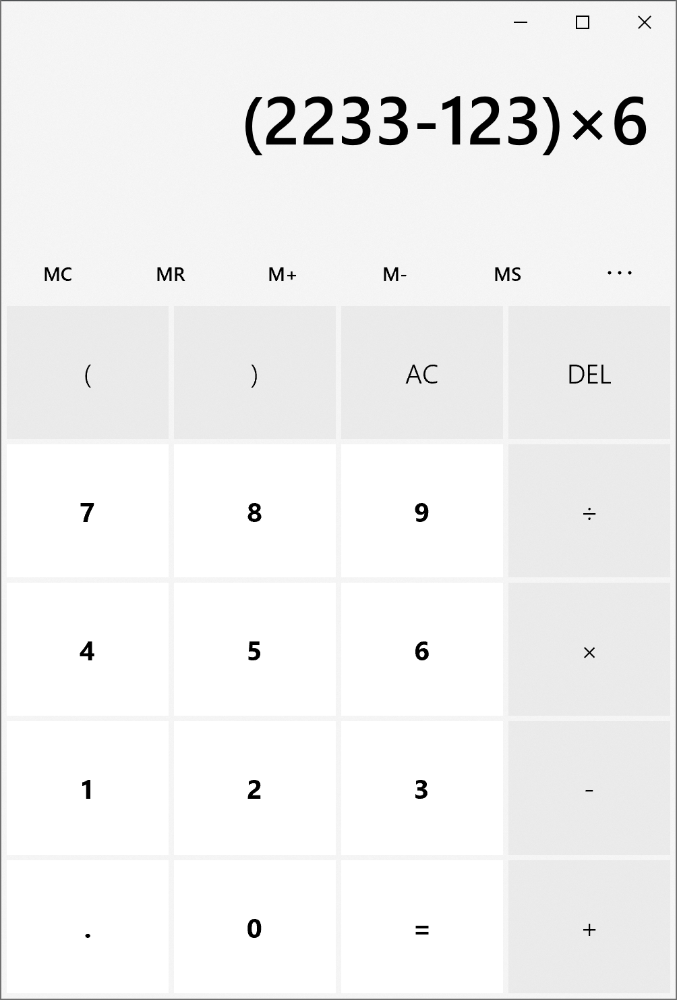
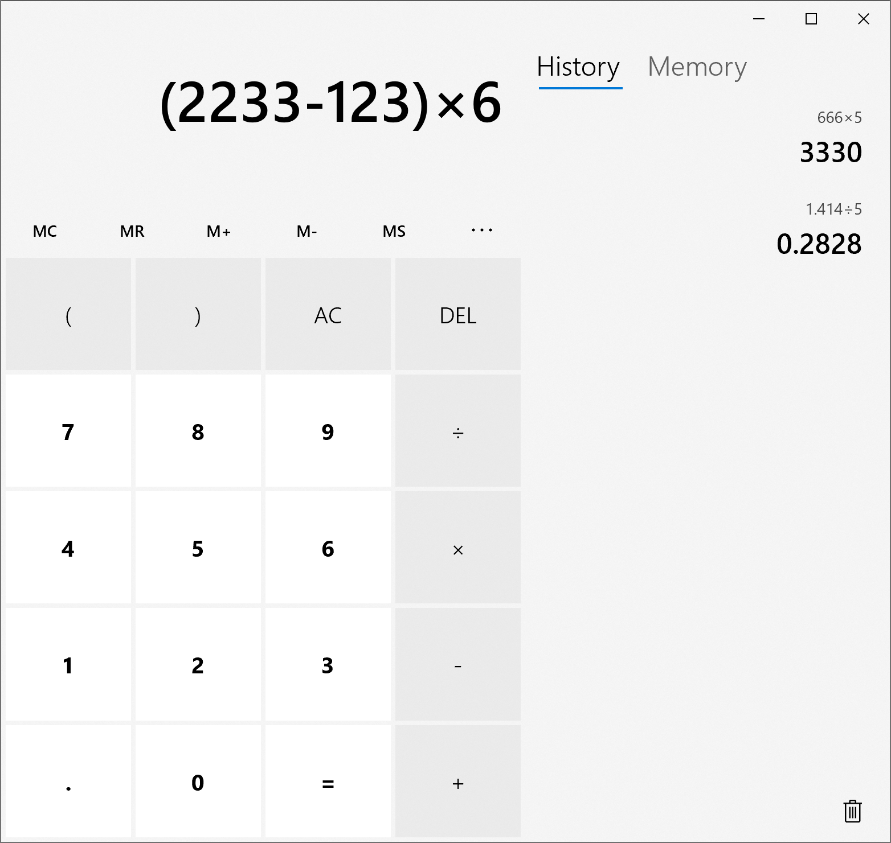
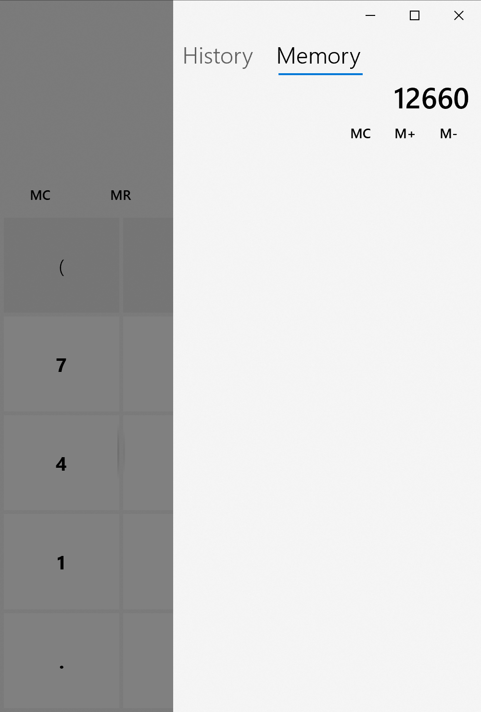

# 说明文档
## 如何安装
1. 系统的设置 -> 更新和安全 -> 开发者选项，打开开发人员模式。
1. 在 AppPackages 文件夹中找到 Install.ps1，右键在 Powershell 中运行。
1. 如果还是不行的话就编译源代码吧。

## 简介
Github 仓库地址：[SimpleUwpCalculator](https://github.com/zhb2000/SimpleUwpCalculator)

本项目为 UWP 应用，使用 C# 语言编写。

## 功能
- 界面为响应式布局。
- 可在侧栏中查看历史记录和存储的数字，点击那三个点的按钮即可展开侧栏。
- 点击历史记录条目即可把之前的运算结果放到面板上。
- 支持运算符优先级和括号。
- 表达式非法时，面板上会显示“Invalid Expression”。

注：程序使用 C# 的 decimal 做运算。

## 效果预览

